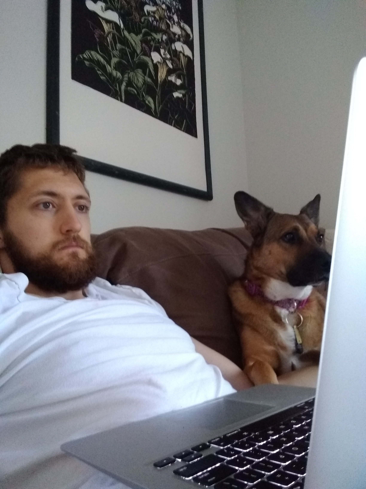
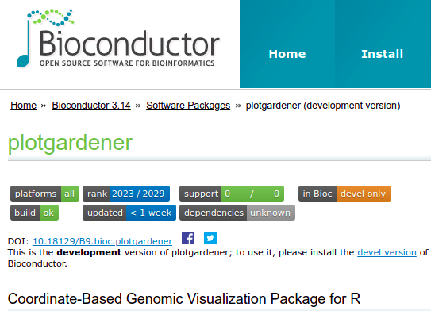
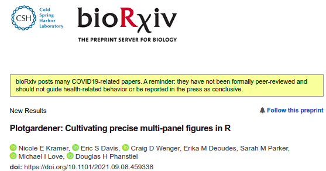

class: middle

```{r setup, include=FALSE}
knitr::opts_chunk$set(echo = FALSE, cache=T, dpi = 300)
```

```{r message=F}
library(tidyverse)
library(emo)
```


.pull-left.middle[

# About me

- New Hampshire native
- 3rd year MMG grad student
- Ellison Lab
- *Drosophila* Host/Transposon interplay

]

.pull-right.middle[

```{r peaches}

```

** Code review **


]

---

# Non-exhaustive list of things I hope to get out of the weekly meeting

* tools
* workflows
* time-savers
* tips and tricks

---

.center2[

```{r, out.height="250px", out.width="450px"}



```


]

---

# Why I like R

- process and import data

--

- clean and shape your data

--

- perform statistical analyses

--

- plot your data

--

- communicate via programmatic websites, documents, apps, slideshows

--

- more specific/exotic stuff
  - visualize geospatial data
  - design and 3D print models
  - access NASA's expoplanet data
  - generative art
  - NLP
  - ...


---

# Why I like R

.center2[

<span style="font-size: 250%;">versatility</span>

]

---

# An R-centric workflow for RNA-seq study

.biglist[

1.  Collect raw data `r emo::ji("page_facing_up")` 
  - *Rsubread -> DESeq2*

1. Format, shape, and integrate with other data
  - *dplyr, bioconductor*

1. Make plots `r emo::ji("bar_chart")`
  - *ggplot2*

1. Write/format a manuscript `r emo::ji("newspaper")`
  - *knitr/Rmarkdown*

]

---

# The missing component

.center2[

<span style="font-size: 150%;">composing figure panels</span>

]

---

# Other options

.middle[

> Currently existing R packages like patchwork, cowplot, gridExtra and Sushi (which was developed by
our group) can be used to arrange multi-panel plots.
However, these layout packages use relative positioning
to place plots, giving users little control over precise sizing and arrangement.

> Figures generated with these tools
often need finishing in graphic design software such as
Adobe Illustrator, Inkscape, PowerPoint, and Keynote. In addition to the cost of purchasing proprietary
graphic design software and the steep learning curve
often associated with their use, generating multi-panel
figures with these software requires non programmatic,
manual user interactions, a labor intensive process that
decreases reproducibility.

]

.footnote[

Plotgardener: Cultivating precise multi-panel figures in R
Nicole E Kramer, Eric S Davis, Craig D Wenger, Erika M Deoudes, Sarah M Parker, Michael I Love, Douglas H Phanstiel
bioRxiv 2021.09.08.459338; doi: https://doi.org/10.1101/2021.09.08.459338

]

---

class: middle

```{r, read-analysis-script, cache=FALSE}
knitr::read_chunk("analysis.R")
```

```{r get-libs, include=F}
```

```{r show-dataset, echo=T}
```

```{r run-deseq2, echo=F, message=F, include=F}
```

```{r make-plots, echo=F, message=F, include=F}
```


.footnote[

1. 10.1371/journal.pone.0099625
2. 10.12688/f1000research.7035

]

---

# patchwork

```{r pw-eg-1, echo=T, message=F, fig.width=7, out.height="400px", fig.align="center"}
library(patchwork)

gt_sample_table + g_sample_all_gene_hm + 
  patchwork::plot_annotation(tag_levels = "A")
```

---

# patchwork w/ more complicated figure plan

```{r pw-eg-2, echo=T, message=F, fig.width=7, fig.height=3, out.height="400px", fig.align="center"}
plot_plan <- "
AABBCC
AABBCC
DDEEEE
DDEEEE
"

gt_sample_table + g_sample_all_gene_hm + g_volc + 
  g_top_2_genes + g_enrich_corticsteroid_up +
  patchwork::plot_annotation(tag_levels = "A") + 
  patchwork::plot_layout(design = plot_plan)
```


---

# Cowplot

```{r cowp-eg-1, echo=T, message=F, fig.width=7, fig.height=3, out.height="200px", fig.align="center"}
library(cowplot)

plot_grid(gt_sample_table,
          g_sample_all_gene_hm, 
          labels = c('A', 'B'),
          align = "h", axis = "rblt",
          label_size = 12)
```

---

# Cowplot w/ complicated figure plan

```{r cowp-eg-2, echo=T, message=F, fig.width=7, fig.height=3, out.height="300px", fig.align="center"}
library(cowplot)

plot_grid(gt_sample_table,
          g_sample_all_gene_hm, g_volc,
          labels = c('A', 'B',"C"),
          align = "h", axis = "rblt",
          label_size = 12)
```

---
# gridExtra

```{r ge-eg-1, echo=T, message=F, fig.width=7, fig.height=3, out.height="300px", fig.align="center"}
library(gridExtra)

grid.arrange(gt_sample_table, 
             g_sample_all_gene_hm, 
             g_volc + theme(aspect.ratio = NULL), 
             g_top_2_genes,
             ncol=3)
```
---

## Summary: difficulties with existing packages

* increased layout complexity -> unexpected behavior
* trouble with alignment
  * fixed-aspect plots w/ non-fixed plots
  * very long labels
  * control of alignment of text versus plot of a figure
* spurious whitespace appears
* text crowding

---

.center2[

```{r}
knitr::include_graphics("https://phanstiellab.github.io/plotgardener/reference/figures/pg-wordmark.png")
```

]

---

```{r set-pg-dev1, echo=F, cache=F}
# https://stackoverflow.com/questions/47736500/knitr-add-to-previous-plot-in-new-code-chunk
knitr::opts_knit$set(global.device = TRUE)
```


```{r create-pg-page, message=F, echo=T, fig.width=9, fig.align="center", cache=F}
library(tidyverse)
library(plotgardener)

{{ pageCreate(width = 7, height = 3, default.units = "inches") }}
```

---

```{r create-plot-lab, message=F, echo=T, fig.width=9, fig.align="center", cache=F}
plotText(label = "A", 
         fontsize = 12,
         x = 0.5, 
         y = 0.5, 
         just = c("right","bottom"), 
         default.units = "inches")
```

---

```{r create-plot-a, message=F, echo=T, fig.width=9, fig.align="center", cache=F}
a <- plotGG(gt_sample_table,
            x = 0.6,
            y = 0.25,
            just = c("left","top"), 
            width = 2.5, 
            height = 2.5)
```

---

```{r, create-plot-b, echo=T, message=F, fig.width=9, fig.align="center", cache=F}
plotText(label = "B", fontsize = 12,
         x = 3.5, y = 0.5, just = c("right","bottom"), 
         default.units = "inches")

b <- plotGG(g_sample_all_gene_hm,
            x = 3.6, y = 0.25,
            just = c("left","top"), 
            width = 2.5, height = 2.5)
```

```{r cache=F}
dev.off()
```

---

```{r create-plot-letter, echo=T, message=F, fig.width=8.5, fig.height=11, fig.align="center", out.height="400px",cache=F}
pageCreate(width = 8.5, height = 11, default.units = "inches")
```

---

.pull-left.middle.watch-out[

```{r, create-plot-letter-3-dummy, echo=T, message=F, fig.width=8.5, fig.height=11, fig.align="center",cache=F,eval=F}
a <- plotGG(gt_sample_table,
            x = 1.35, y = 0.8,
            just = c("left","top"), 
            width = 2.5, 
            height = 2.5)

b <- plotGG(g_sample_all_gene_hm,
            x = 4.6, y = 0.9,
            just = c("left","top"), 
            width = 2.75, 
            height = 2.75)

c <- plotGG(g_volc,
            x = 1.1, y = 3.7,
            just = c("left","top"), 
            width = 2.5, 
            height = 2.5)

d <- plotGG(grid_top10_heat,
            x = 4.5, y = 4.8,
            just = c("left","top"), 
            width = 2.5, 
            height = 2.5)

e <- plotGG(g_top_2_genes ,
            x = 1.1, y = 6.5,
            just = c("left","top"), 
            width = 2.5, 
            height = 2.5)

f <- plotGG(g_enrich_corticsteroid_up,
            x = 1.1, y = 8.3,
            just = c("left","top"), 
            width = 6.5, 
            height = 2)
```

]

.pull-right.middle[

```{r, create-plot-letter-3, echo=F, message=F, fig.width=8.5, fig.height=11, fig.align="center", out.height="450px",cache=F}
a <- plotGG(gt_sample_table,
            x = 1.35, y = 0.8,
            just = c("left","top"), 
            width = 2.5, height = 2.5)

b <- plotGG(g_sample_all_gene_hm,
            x = 4.6, y = 0.9,
            just = c("left","top"), 
            width = 2.75, height = 2.75)

c <- plotGG(g_volc,
            x = 1.1, y = 3.8,
            just = c("left","top"), 
            width = 2.5, height = 2.5)

d <- plotGG(grid_top10_heat,
            x = 4.5, y = 4.8,
            just = c("left","top"), 
            width = 2.5, height = 2.5)

e <- plotGG(g_top_2_genes ,
            x = 1.1, y = 6.5,
            just = c("left","top"), 
            width = 2.5, height = 2.5)

f <- plotGG(g_enrich_corticsteroid_up,
            x = 1.1, y = 8.5,
            just = c("left","top"), 
            width = 6.5, height = 2)

plotText(label = "A", x = 1.25, y = 1, 
         just = c("right","bottom"))
plotText(label = "B", x = 4.5, y = 1, 
         just = c("right","bottom"))
plotText(label = "C", x = 1.25, y = 4, 
         just = c("right","bottom"))
plotText(label = "D", x = 3.75, y = 4, 
         just = c("right","bottom"))
plotText(label = "E", x = 1.25, y = 6.75, 
         just = c("right","bottom"))
plotText(label = "F", x = 1.25, y = 8.5, 
         just = c("right","bottom"))

```

]

```{r, cache=F}
dev.off()
```


---

# Some other fun features

.pull-left.middle[

* Hi-C contact matrices

* bigwig signal

* aligned reads

* genomic spatial relationships (e.g. bedpe)

* gene models/positions

* flexible annotation/highlighting within plots

]


```{r, cache=F, include=F}
## Load libraries and datasets
library("plotgardener")
library("org.Hs.eg.db")
library("TxDb.Hsapiens.UCSC.hg19.knownGene")
library("plotgardenerData")
library("AnnotationHub")
data("GM12878_HiC_10kb")
data("IMR90_HiC_10kb")
data("GM12878_ChIP_CTCF_signal")
data("IMR90_ChIP_CTCF_signal")
data("GM12878_ChIP_H3K27ac_signal")
data("IMR90_ChIP_H3K27ac_signal")
```

.pull-right.middle[

```{r create-plot-vign, echo=F, message=F,fig.align="center",out.width="900px",cache=F}
pageCreate(width = 4, height = 6.5, default.units = "inches")

## Set signal track data ranges
ctcf_range <- pgParams(range = c(0, 77),
                        assembly = "hg19")
hk_range <- pgParams(range = c(0, 32.6),
                      assembly = "hg19")

## Set genomic and dimension parameters in a `params` object
params_d <- pgParams(chrom = "chr21", chromstart = 28150000, chromend = 29150000, 
                      assembly = "hg19",
                      x = 3.5, width = 3, default.units = "inches")
## Plot Hi-C triangle
hic_imr <- plotHicTriangle(data = IMR90_HiC_10kb, params = params_d,
                              zrange = c(0, 70), resolution = 10000,
                              y = 2, height = 1.6, just = c("right", "bottom"))
## Annotate Hi-C heatmap legend
annoHeatmapLegend(plot = hic_imr, fontsize = 7, digits = 0,
                     x = 1, y = 0.4, width = 0.14, height = 1, just = c("right", "top"))
## Plot CTCF signal
ctcf_imr <- plotSignal(data = IMR90_ChIP_CTCF_signal, params = c(params_d, ctcf_range),
                          fill = "#253494", linecolor = "#253494",
                          y = 2.5, height = 1.2, just = c("right", "top"))
## Plot H3K27ac signal
hk_imr <- plotSignal(data = IMR90_ChIP_H3K27ac_signal, params = c(params_d, hk_range),
                        fill = "#37a7db", linecolor = "#37a7db",
                        y = 5.1, height = 1.2, just = c("right", "bottom"))
## Plot gene track
genes_imr <- plotGenes(params = params_d, stroke = 1, fontsize = 6,
                          strandLabels = FALSE,
                          y = 5.14, height = 0.8, just = c("right", "top"))
## Annotate genome label
annoGenomeLabel(plot = genes_imr, params = params_d, 
                   scale = "Kb", fontsize = 7, digits = 0,
                   y = 6, just = c("right", "top"))
```


]


---


.center2[


]


